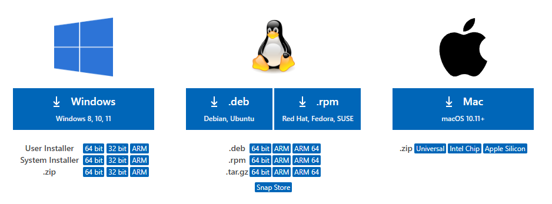
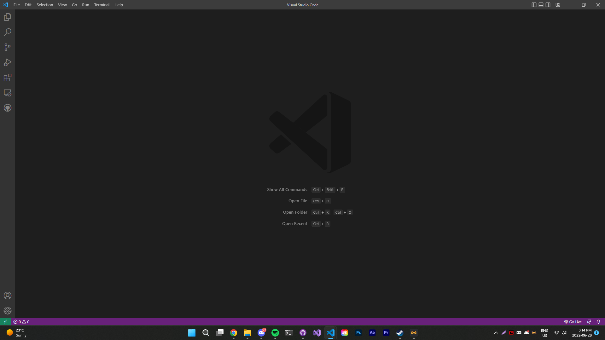
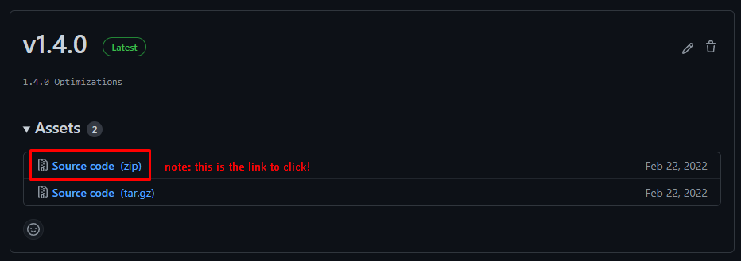
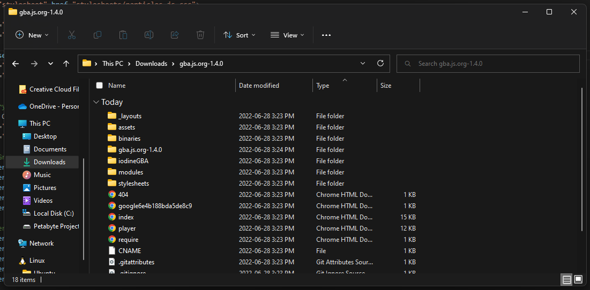
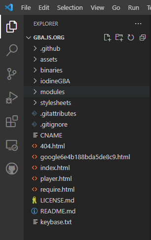
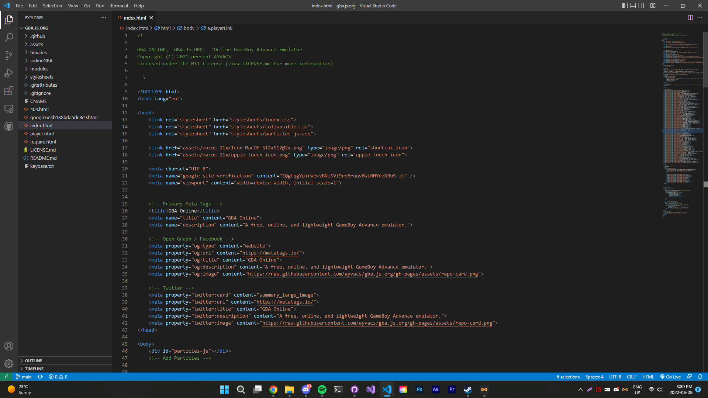
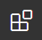
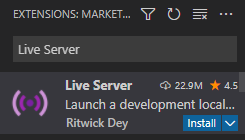
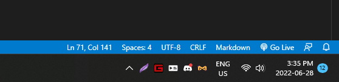

# gba.js.org: Clone the repository and run it locally on your computer.

Hi and thanks for reading this page! Emulators such as gba.js.org are prone to copyright laws because they provide means of accessing digital games which are deemed copyright material under United States federal law.

Therefore, we highly recommend cloning the repository and its files to your computer and running it locally. Running the software locally means that it cannot be taken down by copyright laws and you can use the emulator forever.

If that sounds complicated, don't worry, it really isn't! We'll provide an easy and quick method to get the emulator up and running in minutes.

## Step 1: Downloading VSCode

Visual Studio Code, or VSCode, is the text editor that I use to write gba.js.org. It provides a method to easily create a digital server and host any website's files in seconds. For this tutorial, we will use VSCode to create a temporary server which will host and run our emulator on your computer.

Head to [VSCode's download page](https://code.visualstudio.com/download) and download it for your respective operating system.

Install the software; follow the instructions until you get to the main page. It'll look **similar** to this:

You're doing great so far!

## Step 2: Cloning gba.js.org to your computer

Next, download the gba.js.org source code to your computer which will allow you to run it locally.

Head to [gba.js.org's Downloads page](https://github.com/ayvacs/gba.js.org/releases) and download the latest release by clicking on the first link that says "Source code (zip)".

At the time of writing, the most recent version available through the Downloads page is v1.4.0, so we'll download that one by clicking the "Source code (zip)" link under the "v1.4.0" page.

Next, extract the zip file.

If the extracted folder contains a single folder, move the single folder out of the parent directory. This is the folder we need.

Your folder's contents should look **something** like this:

(Not all of the files or folders will be the same; it's just important that you see a list of files and folders instead of one single folder.)

Move the folder to your Documents folder and remember what it's named because we'll need it later.

## Step 3: Preparing VSCode and running the server

Open VSCode's Explorer by clicking the two documents symbol in the top left of the window. Then, click "Open Folder". Navigate to your Documents folder and select the gba.js.org source code folder which you downloaded in Step 2.

If everything worked well, the site should load in VSCode and you should be able to see a list of project files to the left of your screen. It'll look something like this:

Double-click on "index.html" in the VSCode Explorer. If your screen looks something like this, you've done everything right so far.

It's important to note that we will not be editing the source code, as that is unnecessary. We will simply be running it in a server.

Next, we'll download Live Server, an extension which creates a server on your machine, and which allows us to run the emulator locally.

Open VSCode Extensions Page by clicking Ctrl+Shift+X or clicking the four squares icon to the left. This is what the icons look like:

In the search bar, enter "Live Server". The correct extension is published by "Ritwick Dey". Click the install button.

Wait for the extension to install and load - the Install button should disappear when it is finished installing.

Ensure you are still focused on the index.html file. Wait for a "Go Live" button to appear in the bottom right of your window, and click it.

Wait a bit for the server to start, and before long you should be greeted with gba.js.org's main page. Great job, you've done it! You can now use the emulator without fear of it being taken down. Enjoy your freedom.